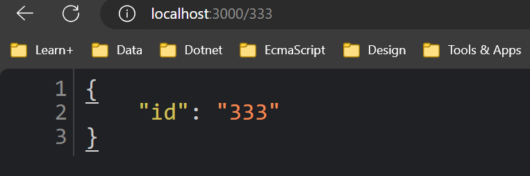

بطور کلی controller ها وظیفه مدیریت درخواست (request) به کمک router handler ها (متد های درون کلاس کنترل) رو دارند.


در nest مکانیسم **routing** با **controller** عجین شده ، یعنی نیاز به ایجاد فایلی جدا برای ایجاد route ها ، مانند کاری که در فریمورک express می کردیم ، نداریم.
در واقع در nest ، سیستم routing بوسیله دکوراتور ها مدیریت می شود.

پس بطور کلی برای ایجاد controller ها به `class` و `decorator` ها نیاز داریم ،  

دکوراتور ها  یه سری `metaData` به کلاس ، متد و یا property پایین خود اضافه می کنند (در واقع عملکرد کلاس ، متد و یا property پایین خود را بدون دستکاری مستقیم آن افزایش می دهند)

و همچنین این Decorator های مربوطه در قسمت controller هستند که  nest رو مجاب به ایجاد سیستم مسیریابی می کنند یا به بیان دیگر این دکوراتور ها هستند که درخواست ها رو به controller های مربوطه گره می زنند.

```tsx
import { Controller, Get } from "@nestjs/common";

@Controller("users")
export default class UserController {
  @Get()
  getUsers():string{
    return 'this route get all users'
  }
}
```

برای ایجاد یک controller توسط nest cli ، از دستور زیر استفاده می کنیم:

```bash
nest generate | g controller | co
```

## Routing——————————-

دکوراتور `@Get()` در واقع route handler پایینش یعنی `getUsers` را به endpoint ای از نوع Get وصلت می دهد
 
 میشه به این دکوراتور path هم پاس داد.
 
```tsx
@Get('test')
```

## Response Object—————————-

Standard (recommended)————-

خود nest تا حد زیادی مسئولیت serialized کردن response رو برعهده می گیرد ؛ به این صورت که اگر یک route handler در controller ما بخواهد `array` یا `object` برگرداند ، nest آن را بصورت اتوماتیک به json سریالایز می کند 
و اگر route handler بخواهد js primitive type مانند `string`, `number`, `boolean` برگرداند ، همان مقادیر را بدون دستکاری و یا سریالایز کردن برمی گرداند.

در واقع شعار nest این هست که ، شما مقداری که می خواید رو return کنید و بقیه کار ها رو به عهده ما بگذارید.

بصورت پیش فرض همه درخواست های زده شده به یک controller دارای statusCode `200` هستند بجز درخواست زده شده به controller ای که http request method اش POST هست که در این صورت statusCode `201` هست.

 می توان این رفتار پیش فرض statusCode رو با استفاده از دکوراتور `@HttpCode(...)` تغییر داد.

Library-specific——————-

میشه کاری کنیم که بتونیم از سیستم ارسال response خود کتابخانه  (express ، fastify و...)  استفاده کنیم که البته پیشنهاد نمیشه ، مگر برای برای موارد خاص.

```tsx
import { Controller, Get, Res } from "@nestjs/common";
import { Response } from "express";

@Controller("users")
export default class UserController {
  @Get()
  getUsers(@Res() response: Response): Response {
    return response.status(200).json({ message: "hello" });
  }
}
```

هنگامی که شی response را در route handler مربوطه تزریق می کنیم ، در واقع مسئولیت فرستادن response رو از دوش nest برداشتیم و وظیفه این کار رو خودمون به عهده گرفتیم ، پس اگر در این شرایط response نفرستیم ، برنامه هنگ می کند.

البته اگر `passthrough` رو برابر با `true` قرار بدیم می تونیم ضمن استفاده از شی response ، مدیریت فرستادن res رو برعهده nest بگذاریم ، این کار زمانی کاربرد داره که می خوایم به شی  response برای موارد دیگری به جز فرستادن response دسترسی داشته باشیم (جلو تر درباره نحوه استفاده از passthrough توضیح داده شده)

## Request Object——————————-

ممکنه نیاز به request object داشته باشیم ، پس نیاز به تزریق آن در route handler (که البته دقیق ترش میشه تزریق در امضای route handler) مربوطه با استفاده از دکوراتور `@Req()` داریم :

```tsx
import { Controller, Get, Req } from '@nestjs/common';
import { Request } from 'express';

@Controller('cats')
export class CatsController {
  @Get()
  findAll(@Req() request: Request): string {
    return 'This action returns all cats';
  }
}
```

خود request object مقادیری داره که با تزریق اونا می تونیم بهشون دسترسی داشته باشیم:

|@Request(), @Req()|req|
|---|---|
|@Response(), @Res()*|res|
|@Next()|next|
|@Session()|req.session|
|@Param(key?: string)|req.params / req.params[key]|
|@Body(key?: string)|req.body / req.body[key]|
|@Query(key?: string)|req.query / req.query[key]|
|@Headers(name?: string)|req.headers / req.headers[name]|
|@Ip()|req.ip|
|@HostParam()|req.hosts|

## resource ——————————-

>[!tip] 
>به entity ها در api نویسی resource می گن.

```tsx
import { Controller, Get, Post } from '@nestjs/common';

@Controller('cats')
export class CatsController {
  @Post()
  create(): string {
    return 'This action adds a new cat';
  }

  @Get()
  findAll(): string {
    return 'This action returns all cats';
  }
}
```

این nest برای همه http method های استاندارد دکوراتور داره:

`@Get()`, `@Post()`, `@Put()`, `@Delete()`, `@Patch()`, `@Options()`, and `@Head()`. In addition, `@All()` defines an endpoint that handles all of them.

## Route wildcards———————-

```tsx
@Get('ab*cd')
findAll() {
  return 'This route uses a wildcard';
}
```

>[!tip]
>استفاده از کاراکتر های `?`, `+`, `*`, and `()` در PATH به عنوان `string patterns` در نظر گرفته می شود. اما کاراکتر های DASH و DOT (- ، .) جزئی از رشته string ای PATH در نظر گرفته می شود.

>[!warning]
>این wildCard ها فقط در Express پشتیبانی می شوند

## Status code——————————-

```tsx
import { HttpCode } from "@nestjs/common";
@Post()
@HttpCode(204)
create() {
  return 'This action adds a new cat';
}
```

 >[!tip]
 >برای زمانی که ممکن است شرایطی پیش بیاد که statusCode داینامیک باشد ، می تونید شی Response رو تزریق کنید و از اون استفاده کنید.

## **Headers——————————-

دو روش برای اضافه کردن header وجود داره :

- اضافه کردن دکوراتور
- یا استفاده از library-specific (تزریق response و استفاده از متد header() آن `res.header()`)

```tsx
@Post()
@Header('Cache-Control', 'none')
create() {
  return 'This action adds a new cat';
}
```

## Redirection——————————-

برای redirection هم مثل headers دو روش `@Redirect()` و یا `res.redirect()` وجود دارد.

دکوراتور @Redirect() دو پارامتر `url` و `statusCode` رو به عنوان ورودی میگیره که اختیاری هم هستند.

دیفالت statusCode `302` برای redirection به معنای Found (قبلا جابه جایی موقت)

```tsx
@Get()
@Redirect('<https://nestjs.com>', 302)
```

>[!tip]
>باید route های داینامیک بعد از route های استاتیک در controller مربوطه شون قرار بگیرند.

در بعضی شرایط شاید بخواهید `redirection` و `statusCode` رو بصورت داینامیک تعیین کنید ، در این شرایط باید controller مربوطه ، اینترفیس `HttpRedirectResponse` را پیاده سازی کند.
این اینترفیس دو property بنام `url` و `statusCode` رو به ما میده و با استفاده ازش می تونیم یک object با دو این دو property ایجاد کنیم:

```ts
export class CatsController implements HttpRedirectResponse {

	statusCode: HttpStatus;  
	url: string;
	
	@Get('docs')
	@Redirect('<https://docs.nestjs.com>', 302)
	getDocs(@Query('version') version) {
	  if (version && version === '5') {
	    return { url: '<https://docs.nestjs.com/v5/>' };
	  }
	}
}
```

در این حالات اولویت با redirect شدن به url درون return است و دکوراتور `@Redirect()` کار نمی کند.

## Route Queries—————————-

```tsx
@Get('docs')
@Redirect('<https://docs.nestjs.com>', 302)
getDocs(@Query('version') version) {
  if (version && version === '5') {
    return { url: '<https://docs.nestjs.com/v5/>' };
  }
}

```

در روش بالا اگر 1000 تا query هم در ورودی وارد بشه فقط اونی که اسمش version هست گرفته میشه ، اگه بخوایم همه query ها دریافت بشن دکوراتور query نباید پارامتر ورودی ای داشته باشه و یا می تونیم از library-specific استفاده کنیم.

```tsx
  @Get()
  getHello(@Query() query:string[]) {
    return query;
  }
```

## **Route parameters———————-**

```tsx
  @Get(":id")
  getHello(@Param() param:string) {
    return param;
  }
```



```ts
@Get(":id")
  getHello(@Param() param:string) {
    return param;
  }
```


 
 اگه تایپ param رو any بزاریم می تونیم به `param.id` دسترسی داشته باشیم.

ولی خب در Ts بهتره به شیوه پایین عمل کنیم:

```tsx
interface Param{
  id:string
}

@Get(":id")
getHello(@Param() param:Param) {
	return param.id;
}
```

حالا اگه بخوایم مستقیم به id دسترسی داشته باشیم:

```tsx
@Get(":id")
getHello(@Param('id') id:number) {
	return id;
}
```

## **Sub-Domain Routing—————————-**

```tsx
@Controller({ host: 'admin.example.com' })
export class AdminController {
  @Get()
  index(): string {
    return 'Admin page';
  }
}
```

```tsx
@Controller({ host: 'localhost' })
export class AdminController {
  @Get()
  index(): string {
    return 'Admin page';
  }
}
```

```tsx
@Controller({ host: 'account.example.com' })
export class AccountController {
  @Get()
  getInfo(@HostParam('account') account: string) {
    return account;
  }
}

```

## **Scopes————————-**

در این باره در بخش Scopes در این باره می خوانیم.

## **Asynchronicity—————————-**

همه async function ها یه Promise رو return می کنند.

```tsx
@Get()
async findAll(): Promise<any[]> {
  return [];
}
```

خود nest بصورت داخلی از RxJs هم پشتیبانی میکنه:

[Observable | RxJS API Document (reactivex.io)](https://reactivex.io/rxjs/class/es6/Observable.js~Observable.html)

```tsx
@Get()
findAll(): Observable<any[]> {
  return of([]);
}
```

>[!tip]
>این `of()` یه عملگر از RxJs هست که یه جریان جدید رو بوجود میاره

## **Request payloads—————————-**

**محموله های درخواست————-**

محموله ها یا داده هایی که قرار است از سمت client ارسال شوند باید در سمت بک اند درون ظرفی ریخته شوند ؛ به ظرفی که برای این داده ها در نظر گرفته شده data transfer object یا `DTO` گویند که می تواند از جنس کلاس یا interface باشد

برای اینکه interface در js وجود ندارد بهتر است این ظرف رو از جنس کلاس در نظر بگیریم تا nest بتواند در زمان اجرا نیز به متادیتا هایی دسترسی داشته باشد مثلا pipe ها metadata ی value رو بررسی می کنند و اگر از dto interface ها بجای dto class ها استفاده کنیم ، دیگر به این متادیتا ، دسترسی نخواهیم داشت.

مکانیزم کار validation pipe ها به این صورته که یه white list با نگاه به dto class ها درست میکنن در مثال پایین white list شامل `name` و `age` و `breed` خواهد بود و هر property ای به جز این سه اگر از request ارسال شود ، آن property نادیده گرفته می شود.

**create-cat.dto.ts**

```tsx
export class CreateCatDto {
  name: string;
  age: number;
  breed: string;
}
```

**cats.controller.ts**

```tsx
@Post()
async create(@Body() createCatDto: CreateCatDto) {
  return 'This action adds a new cat';
}
```

طریقه کار validation payload ارسالی از request به این صورته که `ValidationPipe` ای وجود داره که یک white list ای داره ، که در این whiteList تنها property هایی مجاز اند دریافت شوند که جز property های dto class ما هستند.(البته تنظیماتی هم باید اعمال بشه ، میشه به پارامتر دوم `@Body()` نمونه یا خود کلاس ValidationPipe رو بدیم که در بخش Pipes در این باره صحبت میشه)

## **Handling errors—————————-**

در بخش Exception Filter در این باره می خوانیم.

## **Full resource sample————————-**

```tsx
import { Controller, Get, Query, Post, Body, Put, Param, Delete } from '@nestjs/common';
import { CreateCatDto, UpdateCatDto, ListAllEntities } from './dto';

@Controller('cats')
export class CatsController {
  @Post()
  create(@Body() createCatDto: CreateCatDto) {
    return 'This action adds a new cat';
  }

  @Get()
  findAll(@Query() query: ListAllEntities) {
    return `This action returns all cats (limit: ${query.limit} items)`;
  }

  @Get(':id')
  findOne(@Param('id') id: string) {
    return `This action returns a #${id} cat`;
  }

  @Put(':id')
  update(@Param('id') id: string, @Body() updateCatDto: UpdateCatDto) {
    return `This action updates a #${id} cat`;
  }

  @Delete(':id')
  remove(@Param('id') id: string) {
    return `This action removes a #${id} cat`;
  }
}
```

بسیاری از کار های تکراری مانند ساخت controller برای resource ها رو بوسیله `cli` بصورت خودکار میشه انجام داد.

```powershell
nest g controller [name]
```

## Getting up and running————————-

وقتی یک controller می سازیم ، nest از وجود این controller اطلاعی ندارد و نمی تواند نمونه ای از controller ایجاد شده توسط ما بسازد

در نست controller ها همیشه به فایل ماژول تعلق دارند و آنها را در آرایه ای از controller ها در دکوراتور `@module` و پروپرتی `controllers` تعریف می کنیم:

```tsx
import { Module } from '@nestjs/common';
import { CatsController } from './cats/cats.controller';

@Module({
  controllers: [CatsController],
})
export class AppModule {}
```

دکوراتور @Module() میاد controller ها رو به metaData کلاس `AppModule` ضمیمه می کنه و این باعث میشه تا nest بفهمه چه controller هایی نصب شده اند ، در واقع با این کار قابلیت کلاس AppModule رو بدون دستکاری مستقیم افزایش میده
## **Library-specific approach———————-**

تاکنون در مورد روش استاندارد Nest برای دستکاری پاسخ ها بحث کرده ایم. راه دوم برای دستکاری پاسخ استفاده از یک شی پاسخ خاص کتابخانه است. برای تزریق یک شی پاسخ خاص، باید از دکوراتور @Res() استفاده کنیم. برای نشان دادن تفاوت ها، اجازه دهید CatsController را به صورت زیر بازنویسی کنیم:

```tsx
import { Controller, Get, Post, Res, HttpStatus } from '@nestjs/common';
import { Response } from 'express';

@Controller('cats')
export class CatsController {
  @Post()
  create(@Res() res: Response) {
    res.status(HttpStatus.CREATED).send();
  }

  @Get()
  findAll(@Res() res: Response) {
     res.status(HttpStatus.OK).json([]);
  }
}
```

این کار شاید از برخی جهات انعطاف پذیری بیشتری به ما بده اما معایبی دارد ، مثلا کد ما به یک فریمورک وابسته میشه.

همچنین همانطور که بالا تر گفته شده با این کار ویژگی های خودکار nest برای reponse رو از دست می دهیم که برای رفع این مشکل می توانیم گزینه `passthrough` را به صورت زیر روی true قرار دهید:

```tsx
@Get()
findAll(@Res({ passthrough: true }) res: Response) {
  res.status(HttpStatus.OK);
  return [];
}
```

با این کار تنها کنترل کامل response object که شامل set cookies or headers conditions و… است رو برعهده می گیریم اما بقیه کار ها مثل فرستادن response به سمت client رو به framework واگذار می کنیم.